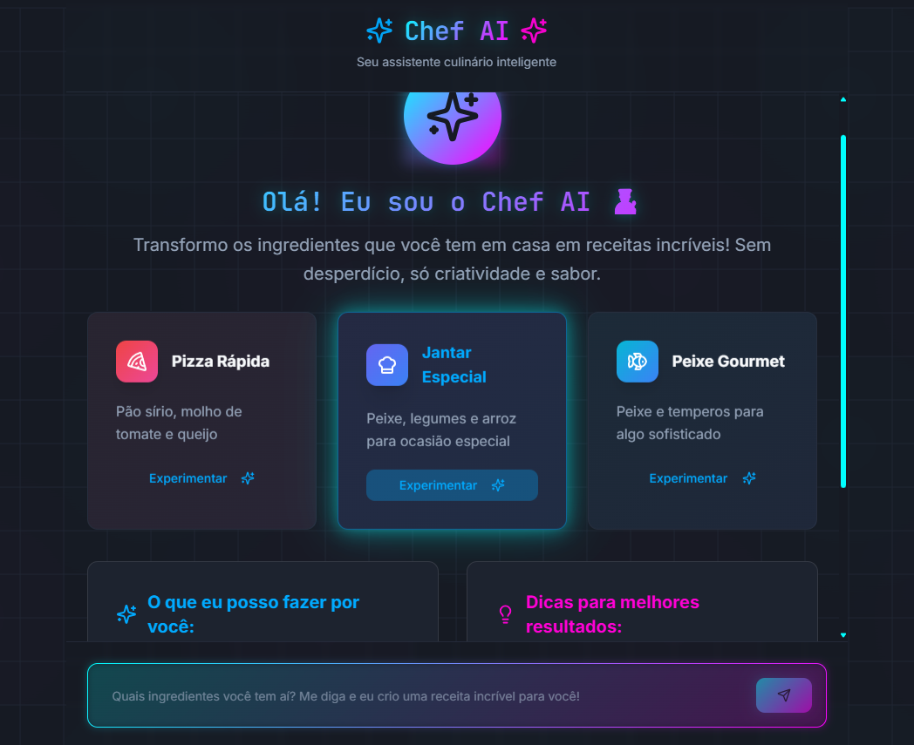
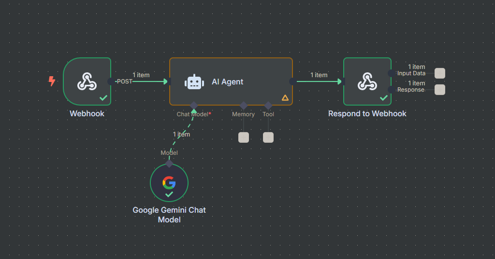

# 🧠 Chef AI - Agente Culinário
<p align="center">
  <!-- Contador de linguagens -->
  
  <!-- Tamanho do repositório -->
  
  <!-- Licença -->
  
</p>

<div align="center">
  
</div>

## 📋 Sobre o Projeto
O **Chef AI** é um projeto desenvolvido no estilo *vibe coding*, unindo criatividade, automação e inteligência artificial. A aplicação consiste em um agente culinário que responde a pedidos de receitas com base em ingredientes enviados pelo usuário. A mágica acontece com a integração entre o **Lovable**, o **n8n** e o modelo **Google Gemini**.

Este é um experimento leve de automação com IA — onde a interface elegante encontra a inteligência conversacional.

## ⚙️ Funcionalidades Principais
* 📥 Recebe ingredientes via Webhook
* 🧠 Usa IA (Google Gemini) para gerar receitas personalizadas
* 🥗 Sugere alternativas e adaptações
* 🖼 Interface elegante com temas variados
* 📤 Retorna resposta pronta com modo culinário

## 🛠 Tecnologias Utilizadas
* **Lovable** (editor AI-driven com deploy fácil)
* **n8n** (orquestrador de fluxos automatizados)
* **Google Gemini Chat Model**
* **React + TypeScript**
* **Tailwind CSS**
* **shadcn/ui**
* **Vite**

## 📂 Estrutura do Projeto
```
├── src/
│   ├── components/              # Componentes visuais reutilizáveis
│   ├── pages/                   # Páginas principais da aplicação
│   ├── styles/                  # Arquivos de estilo com Tailwind
│   ├── hooks/                   # Hooks personalizados
│   └── utils/                   # Funções auxiliares
├── public/                      # Arquivos públicos (imagens, favicon, etc.)
├── index.html                   # Estrutura base do HTML
├── vite.config.ts               # Configuração do Vite
└── README.md                    # Documentação do projeto
```

## 🧭 Guia de Implementação
### 🔹 Usando o Lovable (recomendado)
1. Acesse o projeto em [Lovable](https://lovable.dev/projects/4c6c1b82-1ed0-4aa5-8a2e-ebaff8653149).
2. Faça alterações nos arquivos com auxílio da IA.
3. Clique em **Share > Publish** para atualizar o link público.

### 🔹 Localmente com VSCode
```bash
git clone https://github.com/devAndreotti/my-first-vibe-coding-project.git
cd chef-ai
npm install
npm run dev
```

## 🧠 Como Funciona no n8n
* O Webhook no n8n recebe os dados enviados
* O agente usa o **Google Gemini** para gerar uma resposta
* A resposta é processada e devolvida via **Respond to Webhook**
* O frontend exibe o conteúdo usando React + Tailwind

## 🌐 Visualize o Projeto
Você pode acessar a aplicação publicada neste [link](https://lovable.dev/projects/4c6c1b82-1ed0-4aa5-8a2e-ebaff8653149).

<div align="center">
  
</div>

## 💪 Como Contribuir
Contribuições são muito bem-vindas!
1. Faça um fork deste repositório
2. Crie uma branch: `git checkout -b feature/nome-da-feature`
3. Commit: `git commit -m 'feat: adiciona nova funcionalidade'`
4. Push: `git push origin feature/nome-da-feature`
5. Crie um Pull Request

## 📝 Nota
Este projeto foi construído de forma experimental e prática, unindo ferramentas modernas e inteligência artificial. O foco foi a exploração criativa de possibilidades com automação, IA e frontend interativo.

<br>

---

<p align="center">
  Desenvolvido com ☕ por <a href="https://github.com/seuUsuario">Ricardo Andreotti Gonçalves</a> 🧑‍💻
</p>
